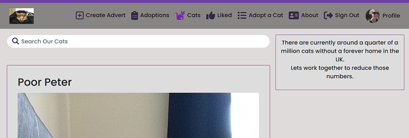
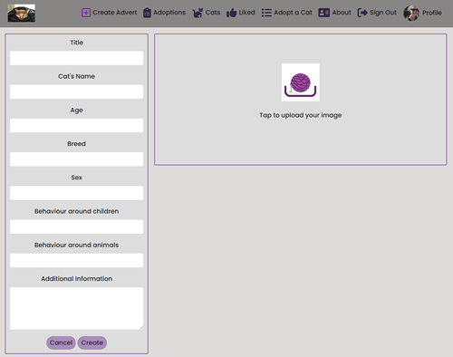
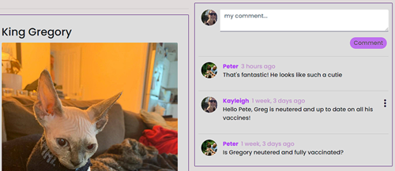

# Project 5 - Purrfect Matches

[Purrfect Matches](https://purrfect-matches-06bb403f2068.herokuapp.com/)

A fictional cat sanctuary that allows users to view the current in house cats and complete adoption queries in order to hopefully adopt.

The homepage for logged in staff members.

A screenshot showing the form staff members can use to advertise current cats.

When a user selects an advert, they are taken to that advert's page, where they can find the comment section.

## ERD's

|        Profile      |           |--|  Adverts   |               |           |             
| ------------------- | --------- |--| ---------- | ------------- | --------- |         
| owner               | OnetoOne  |--| ForeignKey | owner         | User      |
| created_at          | DateTime  |--|            | created_at    | DateTime  |
| updated_at          | DateTime  |--|            | updated_at    | DateTime  |
| name                | Char      |--|            | title         | Char      |
| age                 | Integer   |--|            | name          | Char      | 
| email               | Email     |--|            | age           | Char      | 
| mobile              | Char      |--|            | breed         | Char      |
| location            | Text      |--|            | sex           | Char      |
| previously_owned    | Char      |--|            | children      | Char      |
| currently_own       | Text      |--|            | other_animals | Char      |
| relationship_status | Char      |--|            | content       | Text      |
| children            | Char      |--|            | image         | Image     |
| housing             | Char      |--|            |               |           |
| hobbies             | Text      |--|            |               |           |
| preferred_breed     | Char      |--|            |               |           |
| preferred_age       | Char      |--|            |               |           |
| preferred_sex       | Char      |--|            |               |           |
| image               | Image     |--|            |               |           |

|  Comments  |             |           |--| Adoptions  |             |          |             
| ---------- | ----------- | --------- |--| ---------- | ----------- | -------- |        
| ForeignKey | owner       | User      |--| ForeignKey | owner       | User     |
| ForeignKey | advert      | Adverts   |--| ForeignKey | advert      | Adverts  |
|            | created_at  | DateTime  |--|            | created_at  | DateTime |
|            | updated_at  | DateTime  |--|            | name        | Char     |
|            | content     | Text      |--|            | email       | Email    |
|            |             |           |--|            | mobile      | Char     |
|            |             |           |--|            | content     | Text     |

|   Likes    |             |           |            
| ---------- | ----------- | --------- |       
| ForeignKey | owner       | User      |
| ForeignKey | advert      | Adverts   |
|            | created_at  | DateTime  |