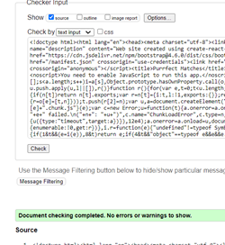
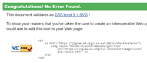

# Project 5 - Purrfect Matches

[Purrfect Matches](https://purrfect-matches-06bb403f2068.herokuapp.com/)

A fictional cat sanctuary that allows users to view the current in house cats and complete adoption queries in order to hopefully adopt.

The homepage for logged in staff members.

A screenshot showing the form staff members can use to advertise current cats.

When a user selects an advert, they are taken to that advert's page, where they can find the comment section.

## ERD's

|        Profile      |           |--|  Adverts   |               |           |             
| ------------------- | --------- |--| ---------- | ------------- | --------- |         
| owner               | OnetoOne  |--| ForeignKey | owner         | User      |
| created_at          | DateTime  |--|            | created_at    | DateTime  |
| updated_at          | DateTime  |--|            | updated_at    | DateTime  |
| name                | Char      |--|            | title         | Char      |
| age                 | Integer   |--|            | name          | Char      | 
| email               | Email     |--|            | age           | Char      | 
| mobile              | Char      |--|            | breed         | Char      |
| location            | Text      |--|            | sex           | Char      |
| previously_owned    | Char      |--|            | children      | Char      |
| currently_own       | Text      |--|            | other_animals | Char      |
| relationship_status | Char      |--|            | content       | Text      |
| children            | Char      |--|            | image         | Image     |
| housing             | Char      |--|            |               |           |
| hobbies             | Text      |--|            |               |           |
| preferred_breed     | Char      |--|            |               |           |
| preferred_age       | Char      |--|            |               |           |
| preferred_sex       | Char      |--|            |               |           |
| image               | Image     |--|            |               |           |

|  Comments  |             |           |--| Adoptions  |             |          |             
| ---------- | ----------- | --------- |--| ---------- | ----------- | -------- |        
| ForeignKey | owner       | User      |--| ForeignKey | owner       | User     |
| ForeignKey | advert      | Adverts   |--| ForeignKey | advert      | Adverts  |
|            | created_at  | DateTime  |--|            | created_at  | DateTime |
|            | updated_at  | DateTime  |--|            | name        | Char     |
|            | content     | Text      |--|            | email       | Email    |
|            |             |           |--|            | mobile      | Char     |
|            |             |           |--|            | content     | Text     |

|   Likes    |             |           |            
| ---------- | ----------- | --------- |       
| ForeignKey | owner       | User      |
| ForeignKey | advert      | Adverts   |
|            | created_at  | DateTime  |

## User Experience (UX)

### User Stories

- As a Site User:
  
  - As a site user, I can create a new account so that I can access all the features for signed-up users
  - As a site user, I can view the navbar from every page so that I can navigate easily between pages
  - As a site user, I can see sign-in and sign up options so that I can sign in or sign up
  - As a site user, I can see other user' avatars so that I can quickly identify the various users
  - As a site user, I can view the details of a single advert so that I can learn more about it, and read the comments
  - As a site user, I can view the most recent adverts, ordered by the most recent first so that I can stay up to date
  - As a site user, I can search for adverts with keywords so that I can find the adverts I am most interested in
  - As a site user, I can keep scrolling through the adverts on the site so that I don't have to click on "next page"
  - As a site user, I can find out more information about the adoption centre so that I can find out what they do to help the cats
  - As a site user, I can be informed that I need to sign in or sign up so that I can view the adoption form, and access other features

- As a Registered User:
  
  - As a registered user, I can sign in so that I can access functionality for logged-in users
  - As a registered user, I can like an advert so that I can show my support for the cats that interest me
  - As a registered user, I can view the adverts I liked so that I can easily find the adverts I was interested in
  - As a registered user, I can add comments to an advert so that I can share my thoughts about the ad
  - As a registered user, I can edit or delete my comments so that I can control the content of my comment
  - As a registered user, I can edit my profile so that I can change my profile picture and information
  - As a registered user, I can update my username and password so that I can change my display name and keep my profile secure
  - As a registered user, I can see the adoption form so that I can fill it out

- As a Staff Member:
  
  - As a staff member, I can create adverts so that I can share cats up for adoption to other users
  - As a staff member, I can view, edit, and delete adverts to keep information up to date
  - As a staff member, I can view user profiles so that I can see if they would be a good fir for the potential adoptions
  - As a staff member, I can see the details of completed adoption forms so that I can begin the adoption process

## Technologies Used

### Languages Used

- HTML

- CSS

- JavaScript

- Python

### Frameworks, Libraries, and Programs Used

1. GitHub:
   - GitHub is used to store the project codes after being pushed from Gitpod.
2. Git:
   - Git is used for version control, to enable commits to Git and the ability to Push to GitHub.
3. Google Fonts:
   - Google Fonts was used throughout the website, for aesthetic purposes in regards to the text.
4. Django (including extensions):
   - dj-database-url enables utilization of the 12factor inspired DATABASE_URL environment variable to configure the Django application.
   - dj-rest-auth is for handling RESTful authentication.
   - Django is the web framework used for building the project.
   - Django Allauth: Used for authentication and account management.
   - Django Cloudinary Storage is Django storage for Cloudinary.
   - Django Filter is used to allow users to filter queryset dynamically.
   - Django REST Framework is a powerful and flexible toolkit for building Web APIs.
   - Django REST Framework Simplejwt: JSON Web Token (JWT) authentication for Django REST Framework.
5. Cloudinary:
   - Cloudinary is used for managing and serving images.
6. Gunicorn:
   - Gunicorn is used as the WSGI server for the Django application.
7. Bootstrap:
   - Bootstrap is a front-end framework used for designing and styling the user interface.
8. Pillow:
   - Python Imaging Library.
9. React (including extensions):
   - React-DOM provides DOM-specific methods that can be used at the top level of the app.
   - React-Bootstrap provides pre-built React components for Bootstrap.
   - React-Router-DOM provides routing capabilities for React applications.
   - React-Toastify is a library for displaying toast notifications in React apps.
   - React-Infinite-Scroll allows infinite scrolling by users.
10. JWT-decode:
   - Library for decoding JSON Web Tokens in JavaScript
11. Axios:
   - Promise-based HTTP client for making asynchronous requests in JavaScript

## Testing

### Validating the Code

index.html has HTML code and when checked, by going to the page and right-clicking for the 'View page source' option to copy the code,
to then paste as 'text input, it was clear of errors in the W3C Markup validator.

The W3C CSS Validator was used to check the CSS code, there were no errors found.

JavaScript was validated using the terminal and built in linter with the Create React App. There were no errors found.

The Code Institute PEP8 Python Linter was used to check the main code for the application. Five errors were reported for lines
being too long. They were altered and the errors fixed. 

### Manual Testing using User Stories from UX Section

Manual testing was carried out every step of the way. Everytime a piece of code was written, it was tested before being committed and pushed to Git.

### Automated Testing

## Deployment

### GitHub

### Heroku

## Credits

### Code

### Content

### Acknowledgements