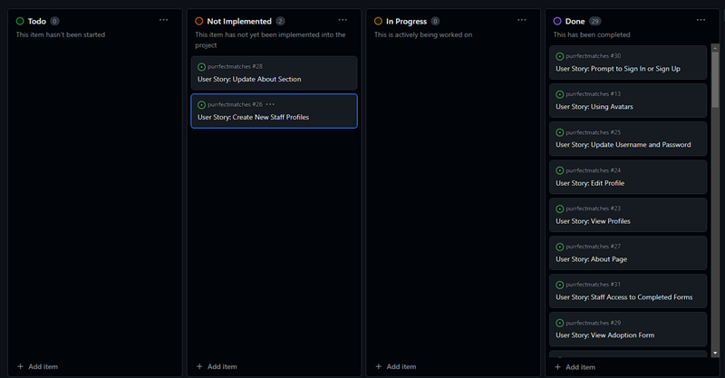
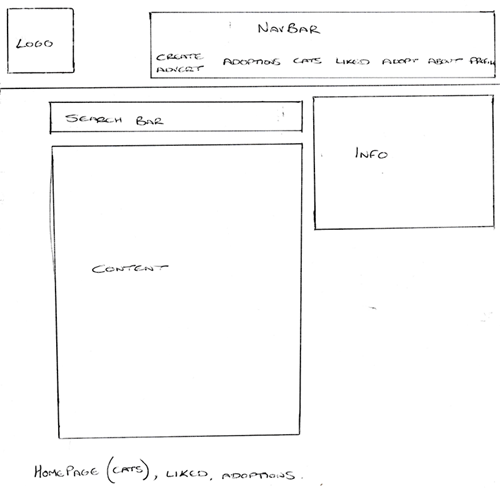
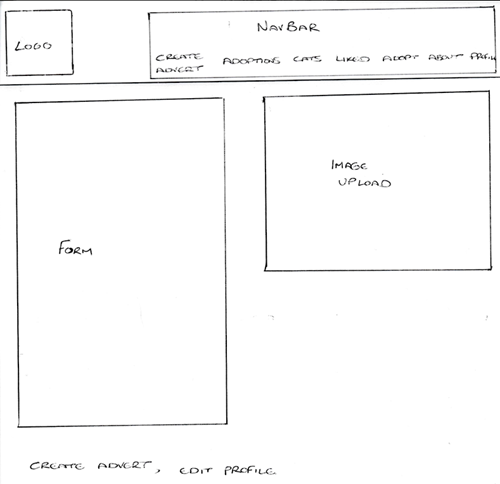
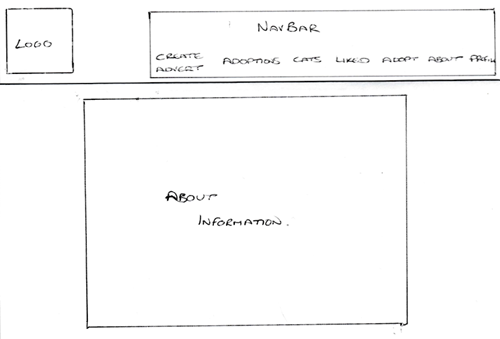
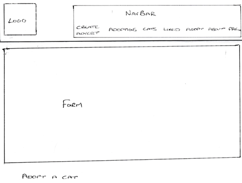

# Project 5 - Purrfect Matches

[Purrfect Matches](https://purrfect-matches-06bb403f2068.herokuapp.com/)

A fictional cat sanctuary that allows users to view the current in house cats and complete adoption queries in order to hopefully adopt.
There are around a quarter of a million cats in the UK without a home. As a cat lover, and owner of a rescue, I think it's important to try and help reduce those numbers.
Whilst this project is fictional, it is my hope that one day, I may be able to make it a reality, and having this application can help to find matches for lost cats and potentially lost humans too. 

The homepage for logged in staff members.

A screenshot showing the form staff members can use to advertise current cats.

When a user selects an advert, they are taken to that advert's page, where they can find the comment section.

## Combined Repositories

Whilst the Django Rest Framework and React Frontend were initially created separately, upon completion of the project, they were then unified. 
This is due to the benefits of creating a single, combined project:
    - Only one repository is required, and CORS is no longer an issue, due to requests and responses coming from a shared baseURL. 
    - This is true for both development and production environments.

The combining of the Django Rest Framework and React Frontend was made possible, by cloning the React Frontend into the Django Rest Framework project,
using the terminal and following command:
   - git clone <react_repo_url> frontend

The above command created the frontend folder within the Django Rest Framework project, which contains the entirety of the React Frontend project.
This did mean that some files did need to be removed due to now having multiple copies. These were the React git folder, .gitignore, and the README file. 

## Agile Methodologies

Throughout this project, Agile methodologies were implemented, with each User Story being documention on GitHub, as seen below:

## ERD's

|        Profile      |           |--|  Adverts   |               |           |             
| ------------------- | --------- |--| ---------- | ------------- | --------- |         
| owner               | OnetoOne  |--| ForeignKey | owner         | User      |
| created_at          | DateTime  |--|            | created_at    | DateTime  |
| updated_at          | DateTime  |--|            | updated_at    | DateTime  |
| name                | Char      |--|            | title         | Char      |
| age                 | Integer   |--|            | name          | Char      | 
| email               | Email     |--|            | age           | Char      | 
| mobile              | Char      |--|            | breed         | Char      |
| location            | Text      |--|            | sex           | Char      |
| previously_owned    | Char      |--|            | children      | Char      |
| currently_own       | Text      |--|            | other_animals | Char      |
| relationship_status | Char      |--|            | content       | Text      |
| children            | Char      |--|            | image         | Image     |
| housing             | Char      |--|            |               |           |
| hobbies             | Text      |--|            |               |           |
| preferred_breed     | Char      |--|            |               |           |
| preferred_age       | Char      |--|            |               |           |
| preferred_sex       | Char      |--|            |               |           |
| image               | Image     |--|            |               |           |

|  Comments  |             |           |--| Adoptions  |             |          |             
| ---------- | ----------- | --------- |--| ---------- | ----------- | -------- |        
| ForeignKey | owner       | User      |--| ForeignKey | owner       | User     |
| ForeignKey | advert      | Adverts   |--| ForeignKey | advert      | Adverts  |
|            | created_at  | DateTime  |--|            | created_at  | DateTime |
|            | updated_at  | DateTime  |--|            | name        | Char     |
|            | content     | Text      |--|            | email       | Email    |
|            |             |           |--|            | mobile      | Char     |
|            |             |           |--|            | content     | Text     |

|   Likes    |             |           |            
| ---------- | ----------- | --------- |       
| ForeignKey | owner       | User      |
| ForeignKey | advert      | Adverts   |
|            | created_at  | DateTime  |

## Reusable Components in React

Reusability and consistency is a big reason to use reusable components in React. Such components were used throughout the project, which are detailed below:

1. NavBar.js: This component is reused in the entire site, to enable a consistent user experience.
2. Asset.js: This component was reused for the: 
    - AdoptionsPage to display a No Results image & message, 
    - AdvertCreateForm to display a default image in the upload image section, 
    - AdvertPage to display a spinner whilst the page loads more comments, 
    - AdvertsPage to display a spinner whilst the page loads more adverts, 
    - ProfilePage to display a spinner whilst the profile details load.
3. Avatar.js: This component was reused for the Adoption, Comment, and CommentCreateForm pages to display the owners profile picture.
4. Info.js: This component was reused for the AdoptionPage, AdoptionsPage, AdvertsPage, ProfilePage pages to display information to the user about cats.
5. MoreDropdown.js: This component was reused for the:
    - Adoption page to display a dropdown menu for staff to delete fulfilled adoption queries,
    - Advert and Comment pages to display a dropdown menu for owners to edit and delete the content.
6. NotFound.js: This component was reused in App.js to display the not found page is a user finds themselves on a page that does not exist.

## Wireframes and Design

### Wireframes

At the very beginning of this project, basic wireframes were drawn up to provide a rough guide to how the site would look. 
These can be seen below:

This provides the main layout for the majority of pages. Every page will have the navbar, with a variety of icons depending on user status. 
The logo will always take the user back to the homepage. There is a search bar and a section for information the relay to the user.
The main bulk of the pages will be taken up by the content:
    - For the homepage and liked page, the content will be the adverts.
    - For the adoptions page, the content will be the completed adoption forms.

This gives an idea as to how the create advert and edit profile forms will look. 
Again, the navbar is visible to the user, but for these views, the main bulk is a form for details and an area for image upload.

This shows that again, the navbar will be visible. However, the only other content on the about page will be the about information.

This provides a basic structure of the adopt a cat page. As always, the navbar is visible and there is an area for the form that will be available to logged in users to complete for adopting a cat. 

### Design

Google Fonts was used throughout the project, mainly Poppins, with an off-white background colour. 
This is because this is more accessible to those of us with dyslexia. Knowing there would be a lot of time spent writing and reading on the pages, I wanted to ensure more ease. Being dyslexic myself, made the process a lot more bearable. 

Purple was used for decoration and the buttons, as it compliments the background colour, without being overbearing.

## User Experience (UX)

### User Stories

- As a Site User:
  
  - As a site user, I can create a new account so that I can access all the features for signed-up users
  - As a site user, I can view the navbar from every page so that I can navigate easily between pages
  - As a site user, I can see sign-in and sign up options so that I can sign in or sign up
  - As a site user, I can see other user' avatars so that I can quickly identify the various users
  - As a site user, I can view the details of a single advert so that I can learn more about it, and read the comments
  - As a site user, I can view the most recent adverts, ordered by the most recent first so that I can stay up to date
  - As a site user, I can search for adverts with keywords so that I can find the adverts I am most interested in
  - As a site user, I can keep scrolling through the adverts on the site so that I don't have to click on "next page"
  - As a site user, I can find out more information about the adoption centre so that I can find out what they do to help the cats
  - As a site user, I can be informed that I need to sign in or sign up so that I can view the adoption form, and access other features

- As a Registered User:
  
  - As a registered user, I can sign in so that I can access functionality for logged-in users
  - As a registered user, I can like an advert so that I can show my support for the cats that interest me
  - As a registered user, I can view the adverts I liked so that I can easily find the adverts I was interested in
  - As a registered user, I can add comments to an advert so that I can share my thoughts about the ad
  - As a registered user, I can edit or delete my comments so that I can control the content of my comment
  - As a registered user, I can edit my profile so that I can change my profile picture and information
  - As a registered user, I can update my username and password so that I can change my display name and keep my profile secure
  - As a registered user, I can see the adoption form so that I can fill it out

- As a Staff Member:
  
  - As a staff member, I can create adverts so that I can share cats up for adoption to other users
  - As a staff member, I can view, edit, and delete adverts to keep information up to date
  - As a staff member, I can view user profiles so that I can see if they would be a good fir for the potential adoptions
  - As a staff member, I can see the details of completed adoption forms so that I can begin the adoption process

## Technologies Used

### Languages Used

- HTML

- CSS

- JavaScript

- Python

### Frameworks, Libraries, and Programs Used

1. GitHub:
   - GitHub is used to store the project codes after being pushed from Gitpod.
2. Git:
   - Git is used for version control, to enable commits to Git and the ability to Push to GitHub.
3. Google Fonts:
   - Google Fonts was used throughout the website, for aesthetic purposes in regards to the text.
4. Django (including extensions):
   - dj-database-url enables utilization of the 12factor inspired DATABASE_URL environment variable to configure the Django application.
   - dj-rest-auth is for handling RESTful authentication.
   - Django is the web framework used for building the project.
   - Django Allauth: Used for authentication and account management.
   - Django Cloudinary Storage is Django storage for Cloudinary.
   - Django Filter is used to allow users to filter queryset dynamically.
   - Django REST Framework is a powerful and flexible toolkit for building Web APIs.
   - Django REST Framework Simplejwt: JSON Web Token (JWT) authentication for Django REST Framework.
5. Cloudinary:
   - Cloudinary is used for managing and serving images.
6. Gunicorn:
   - Gunicorn is used as the WSGI server for the Django application.
7. Bootstrap:
   - Bootstrap is a front-end framework used for designing and styling the user interface.
8. Pillow:
   - Python Imaging Library.
9. React (including extensions):
   - React-DOM provides DOM-specific methods that can be used at the top level of the app.
   - React-Bootstrap provides pre-built React components for Bootstrap.
   - React-Router-DOM provides routing capabilities for React applications.
   - React-Toastify is a library for displaying toast notifications in React apps.
   - React-Infinite-Scroll allows infinite scrolling by users.
10. JWT-decode:
   - Library for decoding JSON Web Tokens in JavaScript
11. Axios:
   - Promise-based HTTP client for making asynchronous requests in JavaScript

## Testing

### Validating the Code

index.html has HTML code and when checked, by going to the page and right-clicking for the 'View page source' option to copy the code,
to then paste as 'text input, it was clear of errors in the W3C Markup validator.

The W3C CSS Validator was used to check the CSS code, there were no errors found.

JavaScript was validated using the terminal and built in linter with the Create React App. There were no errors found.

The Code Institute PEP8 Python Linter was used to check the main code for the application. Five errors were reported for lines
being too long. They were altered and the errors fixed. 

### Manual Testing using User Stories from UX Section

Manual testing was carried out every step of the way. Everytime a piece of code was written, it was tested before being committed and pushed to Git.

- As a Site User:
  
  - As a site user, I can create a new account so that I can access all the features for signed-up users
    - The sign up button is available to users not logged in, which takes users to a form which allows them to create a new account.
    - This was tested by using the sign up button and filling out the form to create new accounts.

  - As a site user, I can see other user' avatars so that I can quickly identify the various users
    - The avatars are displayed next to comments on the single advert pages, which other users are able to see for easy identification.
    - This was tested by going to an advert's page and checking that the avatar was next to the correct comments.

  - As a site user, I can view the details of a single advert so that I can learn more about it, and read the comments
    - If a user clicks on an advert in the home page, they will be taken to that advert's detail page. 
    - This allows the user to learn more and read the comments.
    - This was tested by clicking on an advert and making sure the comments were visible to users.

  - As a site user, I can view the most recent adverts, ordered by the most recent first so that I can stay up to date
    - The adverts are ordered in such a way that the most recent is shown first.
    - This was tested by checking the most recent adverts were shown when the home page was loaded.

  - As a site user, I can search for adverts with keywords so that I can find the adverts I am most interested in
    - There is a search bar at the top of the advert pages, which allows users to filter through the adverts.
    - This was tested by using the search bar successfully to filter through the adverts.

  - As a site user, I can keep scrolling through the adverts on the site so that I don't have to click on "next page"
    - There is an infinite scroll component which allows users to continuing scrolling without needing to click "next page".
    - This was testing by creating more than 10 adverts and ensuring they loaded as the page was scrolled through.

  - As a site user, I can find out more information about the adoption centre so that I can find out what they do to help the cats
    - An About page is available to all users from the NavBar, which provides information on the adoption centre.
    - This was tested by making sure the About link was available to all users, including those not logged in.

  - As a site user, I can be informed that I need to sign in or sign up so that I can view the adoption form, and access other features
    - Throughout the site, there are messages and notifications to prompt users to sign in or sign up when needed.

- As a Registered User:
  
  - As a registered user, I can sign in so that I can access functionality for logged-in users
    - Users not logged in have the option to sign in.
    - This was tested by signing in as various registered users.

  - As a registered user, I can like an advert so that I can show my support for the cats that interest me
    - When a user is signed in, they have ability to use the heart icon to like adverts.
    - This was tested by logging in and using the heart icon successfully.

  - As a registered user, I can view the adverts I liked so that I can easily find the adverts I was interested in
    - Registered users have the Liked icon in the NavBar, which takes them to the list of adverts they have liked.
    - This was tested by liking adverts as a registered user, and making sure they appeared in the liked feed.

  - As a registered user, I can add comments to an advert so that I can share my thoughts about the ad
    - When a user is logged in, the comment form is available to them.
    - This was tested by logging in to make sure the form was available, and then using the form successfully.

  - As a registered user, I can edit or delete my comments so that I can control the content of my comment
    - If a logged in user is the owner of a comment, a dropdown menu will appear to allow them to choose to edit or delete.
    - This was tested by creating comments as a user and then editing and/or deleting.
    - It was also tested that only the onwer of the comment can edit or delete, by logging in as another user and ensuring the dropdown menu was not available.

  - As a registered user, I can edit my profile so that I can change my profile picture and information
    - A registered user is able to access their profile and there is a menu to allow them to edit their details.
    - This was tested by logging in and navigating to the profile page and editing the details.

  - As a registered user, I can update my username and password so that I can change my display name and keep my profile secure
    - A registered user is able to access their profile and there is a menu to allow them to change their username and password.
    - This was tested by logging in and navigating to the profile page and editing the details.

  - As a registered user, I can see the adoption form so that I can fill it out
    - When logged in, users have the option to "Adopt a Cat", which will take them to the adoption form to fill out.
    - This was tested by logging in and navigating to the form, which was then successfully completed.

- As a Staff Member:
  
  - As a staff member, I can create adverts so that I can share cats up for adoption to other users
    - Permissions on the NavBar ensure only staff members can see the "Create Advert" link.
    - Staff are able to follow the link to an advert form, which they can fill out.
    - This was tested by logging is as a staff member, navigating to the advert form and successfully completing it.

  - As a staff member, I can view, edit, and delete adverts to keep information up to date
    - Staff members who own an advert are able to view a dropdown menu to allow for editing and deleting.
    - This was tested by logging in as a member of staff who has already created an advert, in order to check the menu is present.

  - As a staff member, I can view user profiles so that I can see if they would be a good fir for the potential adoptions
    - Completed adoption forms have links to the user's profile, which staff are able to view to check for suitable matches.
    - This was tested by logging in as a staff member, navigating to the completed adoption queries and following the links to the user profiles.

  - As a staff member, I can see the details of completed adoption forms so that I can begin the adoption process
    - Staff members are able to click on an individual adoption form, similar to the users with the adverts, so they can get more details.
    - This was tested by logging in as a staff member and clicking on a completed adoption form to ensure they were taken to the detail page.

There was additional testing done in both Django, which can be found in the "test.py" file for adverts, and React, which can be found in the src folder,
in components, within the "__tests__" folder. 

With more time, I would like to add additional functionality to the About page. I believe it would enhance user experience if staff were able to quickly and easily update the about section with a simple form, that would update in real time for the users. 
I think it would also improve UX if registered users were able to see the adoption queries they had already made, in case they need to make any changes.
Also, with more time, I would like to create a usable admin page to enable staff to create more staff members when new people are hired.

## Deployment

### GitHub

#### Forking the GitHub Repository

By forking the GitHub Repository, a copy can be created. This allows for viewing and editing, without affecting the original. The following steps show how:

    1. Log into GitHub, locate the GitHub Repository.
    2. "Fork" is towards the top of the page, select it.
    3. This provides a copy of the original repository.

#### Making a Local Clone

    1. Start by logging into GitHub.
    2. Locate the required GitHub Repository.
    3. Click the "<> Code" dropdown option.
    4. The link can be copied and cloned.

### Heroku

The site was deployed to Heroku using the following steps:

    1. Log in or create an account at heroku.com.
    2. Click "New" in the top right of the page.
    3. Select the "Create new app" option from the dropdown.
    4. Enter the app name, it must be unique.
    5. Select the Region and click "Create app".
    6. From the newly created app page, navigate to the Settings tab.
    7. Click "Reveal config vars", and add any necessary config vars.
    8. Navigate to the Deploy tab and scroll down to the "Connect to GitHub" option.
    9. Sign in and authorize when prompted to do so.
    10. Find the repository to deploy and click "Connect"
    11. Scroll down to the Manual deploy option and choose the main branch.
    12. Click "Deploy Branch", and once it has finished deploying, the "View" button can be selected to view the live site.

## Credits

### Code

- Code Institute: Without them and the fantastic walkthrough projects, I would be a lot more lost. They lessons and expertise have been absolutely essential. 
- Stack Overflow: Helped me gain an understanding of new concepts and implementing new ideas.
- Slack: Provided me with ideas of where to go for answers.
- https://github.com/MichelleBritton/fabfurryfriends/blob/3611858db311b8c365dc63d9b992651ca6431eea/fabfurryfriends/serializers.py - for help with staff permissions

### Content

- All content was written by the developer, with the help of Code Institute, except for where stated. 
- All media was courtesy of the developer and Lolly Stone, who kindly provided many photographs of their cats.

### Acknowledgements

- Kevin, as always. I would not have got this far without him. Making sure to sit on my keyboard and delete sections of code when it was time for a break. 
- My tutor from the Code Institute, Daisy, who was a massive help in tackling some of the issues I stumbled across. 
- Code Institute, for their fantastic, manageable lessons, which have taught me so much this last year.
- Abi, for allowing me to bounce ideas off of, and rant when things weren't going right. 